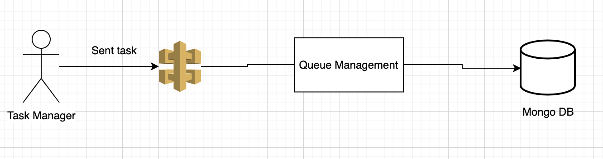

# Queue Management
  ระบบการจัดการคิว จะทำการเรียงลำดับความสำคัญของงานต่างๆที่เข้า โดยจะให้เป็นคะแนน แล้วจะกำหนดความสำคัญให้กับงานนั้นๆ
## Queue Management Architure 


## Features  
  - #### การคิดคะแนน  
      1. ค่า priority * 40
      2. ดูจากผู้สร้างคิวประกอบไปด้วย 4 ลำดับ ได้แต่ Customer, Excutive, Insider, Outsider  
      โดย  Customer จะได้ 10 คะแนน  
      Excutive จะได้ 8 คะแนน  
      Insider จะได้ 5 คะแนน  
      Outsider จะได้ 3 คะแนน  
      3. คำนวนจากความต่างของวัน โดยจะให้ วันที่ค้าง เป็นวันละ 8 คะแนน เช่น สั่งงานมาแล้ว 2 วัน งานจะมีคะแนนเพิ่มขึ้นเป็น 16  
  - #### มีการกำหนด Priority ใหม่ โดย  
  Priority ระดับ 1 คะแนนจะต้องอยู่ในช่วง 0 - 40  
  Priority ระดับ 2 คะแนนจะต้องอยู่ในช่วง 41 -80  
  Priority ระดับ 3 คะแนนจะต้องอยู่ในช่วง 81 - 120  
  Priority ระดับ 4 คะแนนจะต้องอยู่ในช่วง 121- 160  
  Priority ระดับ 5 คะแนนจะต้องอยู่ในช่วง 161 ขึ้นไป  
  - #### Usage :  
  ** URL : `localhost:3000/sentwork  `  **  
  **Method : `POST  `  **  
  **Example Request :  **  
  ```  
    [  
      {  
        "queue_date" : "2019-12-23",  
        "queue_name" : "ประชุมหัวข้อ",  
        "queue_about" : "สรุปยอดขายประจำปี",  
        "queue_create" : "Excutive",  
        "queue_priority" : 4  
      }  
    ]  
    ```  
  Example Respon :  
    ```  
    [  
      {
      "queue_score": 200,
      "queue_priority": 5,
      "difference_day": 4
      }
    ]  
    ```  


## Project Update
   (Wai) 22-12-2019 สร้าง Repository, ออกแบบ Service ต่างๆ, วางโครงสร้างพื้นฐานสำหรับ nodeJS ใช้เวลาประมาณ 5 ชั่วโมง  
   (Wai) 23-12-2019 เชื่อมต่อ MongoDB สามารถสร้างข้อมูลของ Queue ได้แล้ว ใช้เวลาประมาณ 4 ชั่วโมง  
   (Wai) 25-12-2019 สร้าง Function ในการกำหนด Priority ใหม่และให้คะแนนแล้ว ใช้เวลาประมาณ 4 ชั่วโมง  
   (Wai) 26-12-2019 เพิ่มการคิดคะแนนโดยคิดจากจำนวนวันที่สั่งงาน กับ ปัจจุบัน และ แยกฟังก์ชันการกำหนดความสำคัญใหม่ กับ การคะแนน ออกจากตัวโค๊ดหลัก ให้เป็น Function แทน